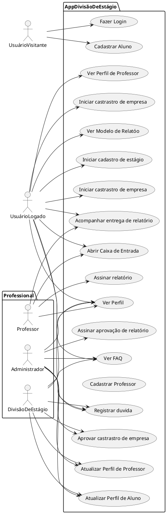
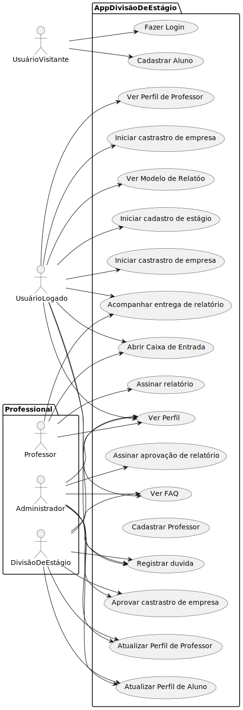

# Especificação dos Requisitos

### Especificações dos Casos de Uso

### Diagrama dos Casos de Uso

```plantuml
@startuml
left to right direction
actor UsuárioVisitante as uv
actor UsuárioLogado as ul
package Professional {
  actor Professor as p
  actor Administrador as a
  actor DivisãoDeEstágio as de
}
package AppDivisãoDeEstágio {
  usecase "Ver Perfil" as UC1
  usecase "Abrir Caixa de Entrada" as UC2
  usecase "Ver Modelo de Relatóo" as UC3
  usecase "Iniciar cadastro de estágio" as UC4
  usecase "Iniciar castrastro de empresa" as UC5
  usecase "Ver Perfil de Professor" as UC6
  usecase "Acompanhar entrega de relatório" as UC7
  usecase "Assinar relatório" as UC8
  usecase "Iniciar castrastro de empresa" as UC9
  usecase "Aprovar castrastro de empresa" as UC10
  usecase "Ver FAQ" as UC11
  usecase "Registrar duvida" as UC12
  usecase "Responder dúvida" as UC13
  usecase "Assinar aprovação de relatório" as UC13
  usecase "Cadastrar Professor" as UC14
  usecase "Atualizar Perfil de Aluno" as UC15
  usecase "Atualizar Perfil de Professor" as UC16
  usecase "Fazer Login" as UC17
  usecase "Cadastrar Aluno" as UC18
}

uv --> UC17
uv --> UC18

ul --> UC1
ul --> UC2
ul --> UC3
ul --> UC4
ul --> UC5
ul --> UC6
ul --> UC7
ul --> UC9
ul --> UC11
ul --> UC12

p --> UC1
p --> UC2
p --> UC7
p --> UC8

de --> UC1
de --> UC10
de --> UC11
de --> UC12
de --> UC15
de --> UC16

a --> UC1
a --> UC10
a --> UC11
a --> UC12
a --> UC13
a --> UC15
a --> UC16
@enduml
```

